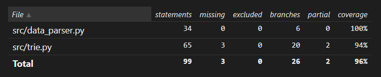

# Testausdokumentti

Ohjelman pääominaisuudet ovat Trie-tietorakenteen ja Markovin ketjun toteutuksen ympärillä. Siksi testit ovat rakennettu testaamaan trie-rakennetta ja sen toimivuutta. Tämän lisäksi tiedosto 'data_parser.py' käy läpi trie-puulle syötettävää materiaalia, joten tiedon oikeellisuutta varten on luotu muutamia testejä. Testit tällä hetkellä alustaa trie-puun ja syöttää sinne muutamia aloitusarvoja. Sen jälkeen testataan erilaisia funktioita, jotka etsivät puusta sanoja ja niiden frekvenssejä. Sanojen ennustaminen perustuu jollain tasolla sattumanvaraisiin tilanteisiin, niin osa testeistä on alustettu antamalla kirjastolle 'random' toiminnolle 'seed' oma arvo.  

Testaus tehdään pääosin muutamilla arvoilla etukäteen annetuilla arvoilla. Esimerkiksi trie-puu saa listan erilaisia sanoja. Osa sanoista ovat samoja, jotta voidaan testata frekvenssejä. Koska arvot ovat aina samat ja random.seed:lle on annettu arvo, niin testit voidaan tällä hetkellä toistaa aina samoilla arvoilla. 

## Coverage-report

